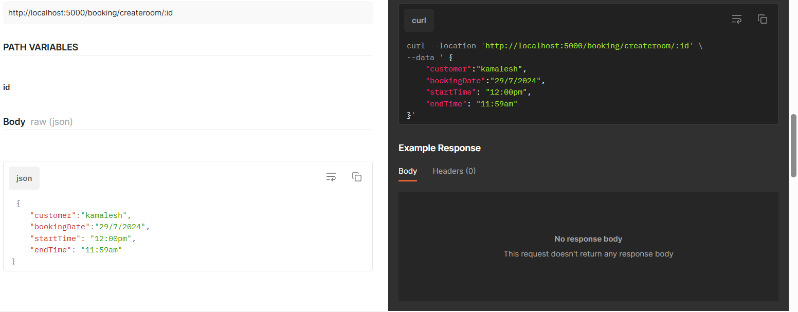

# 🏨 booking-app( Hall Booking API)

A simple Node.js + Express-based API for managing halls/rooms, bookings, and customers.  
This project provides RESTful endpoints to create rooms, book rooms, view bookings, and track customer booking history.

---

## 🚀 Features
- Create new rooms with amenities and pricing.
- View all available rooms.
- Book rooms with date and time validation.
- Track booking details with customer information.
- View all booked rooms with status and timing.
- List all customers with their booking data.
- Get the booking history of a specific customer.
- Prevent double booking of rooms for the same date.

---

## 📂 Project Structure
├── Controller
│ └── hallbooking.js # Contains core logic for rooms, bookings, and customers
├── Routes
│ └── hallbooking.js # Defines all API routes
├── index.js # Entry point of the application
└── README.md # Project documentation

---

## 📥 Clone
Clone the repository 
```bash
git clone https://github.com/Elanthiran/booking-app.git
cd booking-app
```

---

## 📌 Usage

1.Start the Server

  - Run node server.js

  - Server will start at http://localhost:8000

2. Create a Room

- Use the endpoint POST /rooms/create

- Provide room details (ID, amenities, price, seats).

3. View All Rooms

- Use GET /view to see all available rooms.

4. Book a Room

- Use POST /booking/createroom/:id

- Pass customer name, booking date, start time, and end time.

T- he system prevents booking the same room for the same date twice.

5. View All Bookings

- Use GET /viewbooking to check all booked rooms with details.

6. List All Customers

- Use GET /customers to see all customers with their bookings.

7. Get Customer Booking History

- Use GET /customer/:name to view how many times a customer has booked a room.

---

📸 Screenshots
 
 postman link "https://documenter.getpostman.com/view/35185833/2sAXjT1V78" for hallbooking 




---

## 🛠️ Tech Stack
- Node.js – JavaScript runtime

- Express.js – Web framework

- JavaScript (ES6) – Core language

- Postman/Thunder Client – API Testing

---

## 🔮 Future Improvements
- Connect with MongoDB for persistent storage.

- Add authentication (JWT) for secure access.

- Add pagination and filtering in APIs.

- Implement frontend with React for room booking UI.

- Admin panel for managing rooms and bookings.

---

## 🤝 Contributing
Contributions are welcome!

- Fork the repository

- Create a feature branch (git checkout -b feature-name)

- Commit changes (git commit -m "Add new feature")

- Push to branch (git push origin feature-name)

- Create a Pull Request

---

## 📜 License
This project is licensed under the MIT License.
You are free to use, modify, and distribute this project.
